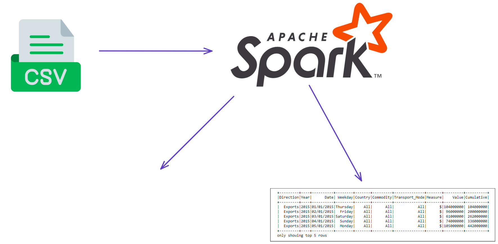
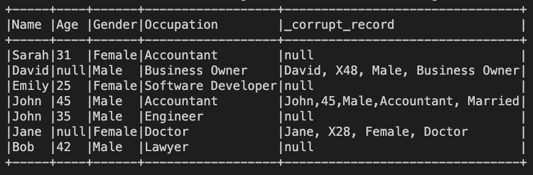
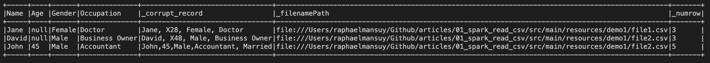

# How to Parse a CSV File and Display Errors during Parsing with Spark



## Introduction

Dealing with CSV files that have millions of lines can be a tough task, particularly when you require detailed error messages.

In this article, we'll look into how to parse CSV files using Apache Spark, and how to show errors while parsing.

## Understanding CSV Files

Before we dive into parsing, it's important to understand the format of CSV files.

- A CSV file is a simple text file that stores data in tabular form.
- Each line of the file represents a row, and each value within a row is separated by a comma.
- CSV files can contain headers, which describe the data within each column.

Here's an example of a simple CSV file:

```csv
Name, Age, Gender, Occupation
John, 35, Male, Engineer
Jane, 28, Female, Doctor
Bob, 42, Male, Lawyer
```

In this example, the CSV file contains four columns: Name, Age, Gender, and Occupation. Each row represents a person, with their name, age, gender, and occupation listed in the corresponding columns.

In addition to commas, CSV files may use escape characters to handle special characters such as commas or line breaks.

Here's an example of a CSV file that uses escape characters:

```csv
Name, Age, Description
John, 35, Loves to play guitar\, especially when it's raining outside.
Jane, 28, Enjoys hiking and camping in the mountains. Her favorite season is fall.
Bob, 42, Likes to read\, watch movies, and spend time with his family.
```

In this example, the third column titled "Description" contains commas. Normally, commas are interpreted as separators between values. To handle this, we use a backslash "\" before the comma to instruct the parser to not interpret the comma as a separator.

Some CSV files may use quote fields to encapsulate fields that contain special characters.

```csv
Name,Email,Phone Number
John Smith,john.smith@gmail.com,"(123) 456-7890"
Jane Doe,jane.doe@yahoo.com,"(555) 123-4567"
"Johnson, Jr.",jjohnson@hotmail.com,"(999) 999-9999"
```

Additionally, some CSV files may support multiline fields. These fields are enclosed in quotes and may span multiple lines.

Example:

```csv
Name,Description
John,"John is a software engineer with over 5 years of experience in web development. He is skilled in HTML, CSS, JavaScript, and various web frameworks. In his free time, John enjoys playing basketball and watching movies."
Jane,"Jane is a marketing specialist with a strong background in digital marketing. She has worked with several prominent companies in the past and has helped them achieve great success in their marketing campaigns. In her free time, Jane likes to travel and try new cuisines."
```

In this example, the Description field for each record is enclosed in quotes and spans multiple lines. This allows for more detailed and descriptive information to be included in the CSV file. When parsing such files, it's important to properly handle multiline fields to ensure that the data is correctly extracted and processed.

## Parsing CSV Files with Apache Spark

Apache Spark is a powerful framework for distributed computing that can be used for parsing and processing large CSV files. In Spark, we can use the `SparkSession` class to create a DataFrame that represents the CSV file. Here's an example in Scala:

### Creating a SparkSession

```scala
  def spark = {
    val spark = SparkSession
      .builder()
      .appName("SparkReadCSV")
      .master("local[*]")
      .getOrCreate()

    // Set log level to ERROR
    spark.sparkContext.setLogLevel("ERROR")

    // Shutdown hook to close SparkSession nicely
    sys.addShutdownHook(spark.stop())
    spark
  }
```

### Definition of a schema corresponding to the CSV file

```scala
  def schema = StructType(
    Array(
      StructField("Name", StringType, true),
      StructField("Age", IntegerType, true),
      StructField("Gender", StringType, true),
      StructField("Occupation", StringType, true)
    )
  )
```

### Reading a CSV File

```scala
    // add corrupt record column to schema
    val schemaWithCorruptedColumn =
      schema.add(StructField("_corrupt_record", StringType, true))

    // read csv file with schema
    val df = spark.read
      .option("header", "true")
      .schema(schemaWithCorruptedColumn)
      // mode PERMISSIVE: nulls for missing values
      .option("mode", "PERMISSIVE")
      .option("sep", ",")
      .option("quote", "\"")
      .option("escape", "\\")
      .option("ignoreLeadingWhiteSpace", "true")
      // corrupt column name
      .option("columnNameOfCorruptRecord", "_corrupt_record")
      .csv("src/main/resources/demo1/")

```

This code is used to read a CSV file using Spark and add a column for corrupted records to the DataFrame schema.

The first part of the code adds a new column named "_corrupt_record" to the existing schema using the add method of the StructType class. This column will store the corrupted records if any.

Next, the code reads the CSV file using the spark.read method with various options. The header option specifies that the first line of the CSV file contains the column names. The schema option specifies the schema of the DataFrame, which includes the new "_corrupt_record" column added in the previous step.

The mode option specifies how to handle corrupt records. The **PERMISSIVE** mode allows nulls for missing values and stores corrupted records in the **"_corrupt_record"** column.

The sep, quote, escape, and ignoreLeadingWhiteSpace options specify the separator, quote character, escape character, and whether to ignore leading white space respectively.

Finally, the columnNameOfCorruptRecord option specifies the name of the column that stores corrupted records. In this case, it is "_corrupt_record". The CSV file is read from the "src/main/resources/demo1/" directory. The resulting DataFrame df will have the schema with the "_corrupt_record" column and will contain the data from the CSV file.

### Displaying the DataFrame

```scala
df.show(false)
```



The issue with this approach is that the DataFrame will contain null values for the corrupted records. This makes it difficult to identify the corrupted records.

- no information about the line number
- no information about the file name (if multiple files are read)

This can be solved as follows.

## Display Errors with file name and line number

```scala
  def displayErrorRecords(df: DataFrame, hasHeader: Boolean = true) = {
    import org.apache.spark.sql.functions._
    import org.apache.spark.sql.expressions.Window

    val columnNameOfCorruptRecord = "_corrupt_record"
    val addLine = hasHeader match {
      case true  => 1
      case false => 0
    }

    val dfMalformed =
      df.withColumn("_globalnumrow", monotonically_increasing_id())
        .withColumn("_filenamePath", input_file_name())
        .withColumn(
          "_numrow",
          row_number()
            .over(
              Window
                .partitionBy("_filenamePath")
                .orderBy("_globalnumrow")
            ) + addLine
        )
        .drop("_globalnumrow")
        .filter(col(columnNameOfCorruptRecord).isNotNull)

    dfMalformed.show(false)
  }
```

Result of the function displayErrorRecords:



The dataframe dfMalformed contains the following columns:

- _filenamePath: the path of the file
- _numrow: the line number of the corrupted record within the file
  


## Conclusion

This article shows how to read a CSV file using Apache Spark and how to display the errors with the file name and line number.

